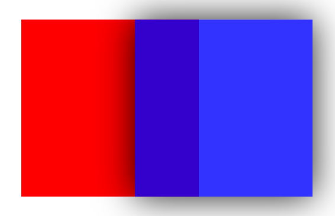
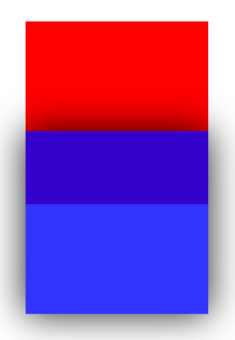

# negative margin

## 1. negative margin 이란

> margin속성에 음수 값을 주는 것...근데 그게 왜?
> 양수 값을 주었을 때랑은 다르게 동작한다! 어떻게 동작하는지 알아보자.

## 2. 동작 설명


- 위의 그림에서 보면, (top, left)와 (right, bottom) 쌍으로 비슷하게 동작하는 것을 알 수 있다.
- 그렇다는 것은... (top, left)와 (right, bottom)쌍이 동작하는 방식에 차이가 있다는 것! 그 차이에 대해서 알아보자.

<br>

## 2-1. margin-left

### margin-left에 음수 값을 주었을 때

- HTML

```html
<div class="box1"></div>
<div class="box2"></div>
```

- CSS

```css
* {
  font-size: 0;
}
.box1 {
  display: inline-block;
  width: 100px;
  height: 100px;
  background-color: red;
  margin-left: -30px; /* 마진 음수 */
}
.box2 {
  display: inline-block;
  width: 100px;
  height: 100px;
  background-color: blue;
}
```

- 빨간색 박스의 margin-left에 음수 값을 주었을 경우 아래와 같이 동작한다.

    

  > 빨간색 박스가 왼쪽으로 요소가 이동하게 된다!

  > 마진을 주지 않은 오른쪽 요소의 변화는 없다.

<br>

## 2-2. margin-top

### margin-top에 음수값을 주었을 때

- CSS

```css
* {
  font-size: 0;
}
.box1 {
  width: 100px;
  height: 100px;
  background-color: red;
  margin-top: -40px; /* 음수 마진 */
}
.box2 {
  width: 100px;
  height: 100px;
  background-color: blue;
}
```

- 빨간색 박스의 margin-top에 음수 값을 주었을 경우 아래와 같이 동작한다.

    

  > 빨간색 박스가 위쪽으로 이동한다! 마진을 주지 않은 파란색 박스의 변화는 없다.

  > 이는 margin-top과 동일하게 동작한다는 사실을 알 수 있다.

### 만약 inline-block인 경우 margin-top을 음수로 한다면?

- CSS

```css
* {
  font-size: 0;
}
.box1 {
  display: inline-block;
  width: 100px;
  height: 100px;
  background-color: red;
  margin-top: -40px;
}
.box2 {
  display: inline-block;
  width: 100px;
  height: 100px;
  background-color: blue;
}
```

- 그 결과... 빨간색 박스가 위로 안움직이네?

    

  > " 요소가 떠 있는 방향(inline-block의 경우엔 좌우로) "와 " margin의 방향 "이 일치하지 않으면, negative margin이 먹히질 않는다!

  > 이는 주의해야할 부분이다.

### 그렇담 블록에 float값을 준 경우...?

- float 속성을 적용한 요소에 음수 마진을 주어보자.

- CSS

```css
* {
  font-size: 0;
}
.box1 {
  float: left; /* float 처리 */
  width: 100px;
  height: 100px;
  background-color: red;
  margin-top: -40px; /* 음수 마진 */
}
.box2 {
  clear: both; /* float 클리어 처리 */
  width: 100px;
  height: 100px;
  background-color: blue;
}
```

- 그 결과?

    

  > 동작에 있어서 차이가 없다!

  > 그럼 왜 언급하냐..? left, top이 아닌, bottom, right에 음수 마진 값을 주면 동작에 차이가 있기 때문! 이제 right, bottom에 대해 알아보자.

<br>

## 2-3. margin-right

> margin-right에 음수값을 주었을 때

- CSS

```css
* {
  font-size: 0;
}
.box1 {
  display: inline-block;
  width: 100px;
  height: 100px;
  background-color: red;
  margin-right: -40px;
}
.box2 {
  display: inline-block;
  width: 100px;
  height: 100px;
  /* 식별을 위한 styling */
  background-color: rgba(0, 0, 255, 0.8);     /* alpha값 추가 */
  box-shadow: 0px 0px 20px rgba(0, 0, 0, 0.9);    /* shadow 추가 */
}
```

- 빨간색 박스에 margin-right을 음수로 적용한 결과...

    

  > 빨간색 요소의 위치는 이동하지 않고, 마진 값을 주지 않은 파란색 요소를 자신의 오른쪽 영역으로 끌어당겼다!

  > left & top 은, 마진값을 준 요소가 움직인 반면, right & bottom 은 마진값을 주지 않은 요소를 마진값을 준 요소 내부로 끌어당긴다.

<br>

## 2-4. margin-bottom

### margin-bottom에 음수값을 주었을 때

- CSS

```css
* {
  font-size: 0;
}
.box1 {
  width: 100px;
  height: 100px;
  background-color: red;
  margin-bottom: -40px;
}
.box2 {
  width: 100px;
  height: 100px;
  /* 식별을 위한 styling */
  background-color: rgba(0, 0, 255, 0.8);     /* alpha값 추가 */
  box-shadow: 0px 0px 20px rgba(0, 0, 0, 0.9);    /* shadow 추가 */
}
```

- margin-bottom에 음수값을 준 결과...

    

  > right에 음수를 준 것과 동일하게, 마진을 주지 않은 요소가 마진을 준 요소의 자리를 침범하게 된다.

### float값을 주었을 경우?

- float 속성을 적용한 요소에 음수 마진을 주어보자.

- CSS

```css
* {
  font-size: 0;
}
.box1 {
  float: left; /* float 처리 */
  width: 100px;
  height: 100px;
  margin-bottom: -40px; /* 음수 마진 */
  /* 식별을 위한 styling */
  background-color: rgba(255, 0, 0, 0.8);     /* alpha값 추가 */
  box-shadow: 0px 0px 20px rgba(0, 0, 0, 0.9);    /* shadow 추가 */
}
.box2 {
  clear: both; /* float 클리어 처리 */
  width: 100px;
  height: 100px;
  background-color: blue;
}
```

- 빨간색 요소의 내부를 파란색 요소가 침범하지 않았다!

    

  > 마진을 준 요소의 내부를 침범하지 않고, 그 아래로 숨는 것을 확인할 수 있다.<br>
  > float의 원리상 box1은 3차원 공간에서 상단에 부유하게 되기 때문<br>
  > [더 알아보기 : CSS Float 및 Clear 설명-CSS float 및 clear는 어떻게 작동합니까? - YouTube](https://www.youtube.com/watch?v=xara4Z1b18I)
  > 

## 3. 정리

1. margin-top & margin-left

   > 마진을 준 요소 : 마진을 준 방향으로 요소가 이동함.

   > 마진을 주지 않은 요소 : 동작에 변화가 없음.

2. margin-bottom & margin-right

   - float가 아닌 경우

     > 마진을 준 요소 : 동작에 변화가 없음.

     > 마진을 주지 않은 요소 : 마진을 준 요소의 내부를 마진을 준 방향으로 침범함.

   - float인 경우

     > 마진을 준 요소 : 동작에 변화가 없음.

     > 마진을 주지 않은 요소 : 마진을 준 요소의 아래로 마진을 준 방향으로 이동함.

3. 위의 두가지 경우는 모두 마진을 준 방향과, 요소가 떠 있는 방향이 일치해야 한다.

   > 일치하지 않다면 음수 마진의 동작이 일어나지 않는다.

<br>

## 4. 생각해볼 거리

- a11y-hidden 클라스를 추가하여, 스크린 리더에게는 노출 되지만 브라우저상 가시적으로 요소를 노출되지 않게하는 방법에서 margin: -1px이 적용되었습니다. 이는 어떤 요소가 어떤 동작을 하게 된 것일까요?

- IE에서 negative margin을 지원 할까요?
